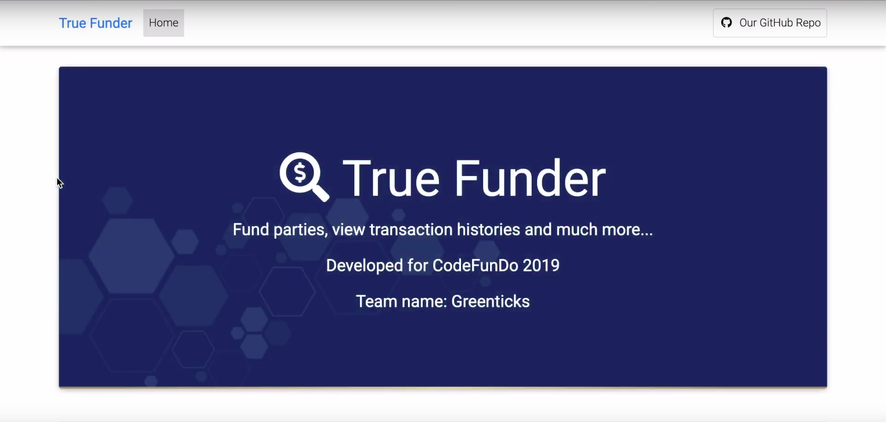

# True Funder

### Enabling transparent political party funding using Blockchain

### First Runners Up - Microsoft CodeFunDo 2019

### Team
* [Rohan Chacko](https://github.com/RohanChacko)
* [AadilMehdi Sanchawala](https://github.com/aadilmehdis)

## Contents

* [Idea](#idea)  
  * [Problem Statement](#problem-statement)
  * [Proposed Solution](#proposed-solution)
  * [Working](#working)
  * [Features](#features)
  * [Stack](#stack)

* [Getting Started](#getting-started)

## Idea

### Problem Statement

Political party financing can distort the electoral process and is a major motive for grand corruption. Such corruption is a significant problem in many countries including both developed and developing countries.
The particular pressures for corrupt financing in developing countries are related to the lack of legitimate sources of finance, such as business, trade unions and party membership, coupled with expensive and anti-democratic party activities, such as vote buying. Thus, it is imperative to enforce a system of transparency for political party funding so that we can have better informed voters electing non-fraudulent politicians.

### Proposed Solution

Allowing financial transparency is an important facet for any functioning democracy. Knowledege of fund flow enables voters to know how their money is being used by the parties they support. We propose a system where in all the transactions done by the political parties, happen through a blockchain network.

Any donations or fundings given to the political parties are registered transactions in the network. All the party expenditures are in this system. Thus by limiting all the online transactions of all the political parties to this blockchain network we can find out the difference between the amount of money donated to the parties and the amount of expenditure done by the parties. This transaction system will be enforced in the regular election commission machinery.

### Working

Using stablecoins as a blockchain-based cryptocurrency solution. The EC enforces that all transactions made by political parties (be it expenditures or donations accepted) are made through the stablecoin platform. The public ledger can then be audited by the EC for all transactions made. In this way, all voters can track how much funding a party receives since all transactions happen on this network.

### Features

* Transparency of transactions
* Stable monetary value : Since we are using stablecoins as form of currency
* Verifiability: Blockchain inherently ensures it
* Accessiblility: Anyone anywhere using this system can access the data
* Scalable: Since this system uses Azure Blockchain Services to enable cryptocurrency transactions supported by EC and other relevant organisations
* Analytics : We provide in-depth analytics regarding how each political party spends the funds they receive along with region wise
information of fund flow

### Stack

* Azure Services
* Ethereum Blockchain as a Service (EBaaS) on Microsoft Azure
* Smart Contracts

## Getting Started

### Setting up MetaMask
* Install the MetaMask Chrome extension from  [here](https://chrome.google.com/webstore/detail/metamask/nkbihfbeogaeaoehlefnkodbefgpgknn)

* Make an account and set up a wallet

### Running the application

* Install dependencies: `pip install -r requirements.txt`
* Run the app locally: `python manage.py runserver`
